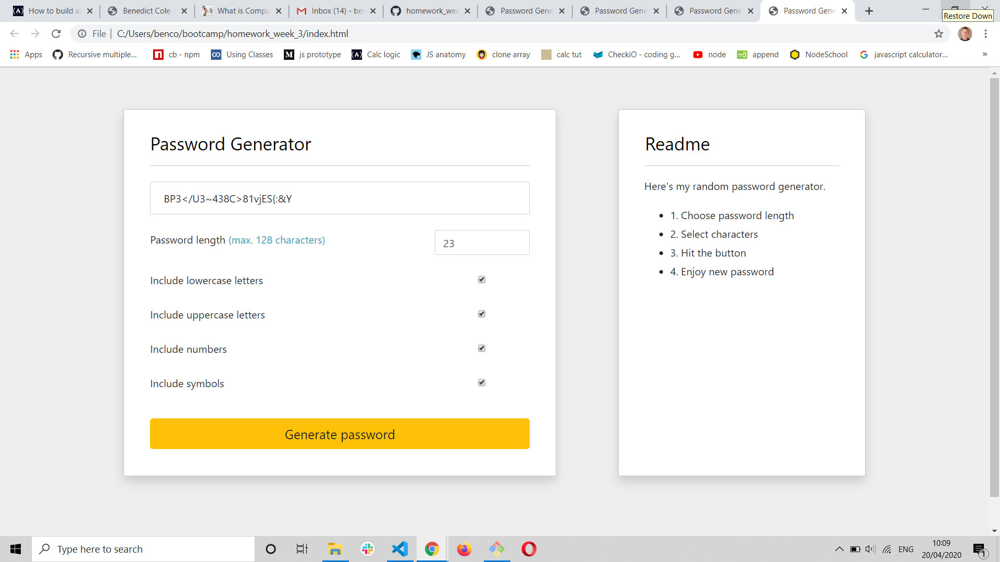

# 03 JavaScript: Password Generator

This project features a random password generator that allows the use to choose from 4 different types of characters;
- Lowercase letters
- Uppercase letters
- Numbers 0 - 9
-Special characters

The user can select a password up to 128 characters long and chose the mix of character types they wish to include in the new password.

## The password generator

 

## Technologies

The project has been built using;
- HTML 5
- CSS
- JavaScript

## About this project

The project has been built using JavaScript primarily. It features Methods like Maths.random and Maths.floor to generate unique password combinations. I have used variables, arrays and functions to create the project and continue to broaden my knowledge of JavaScript. I have chosen to use the same UI and graphic language as my earlier portfolio submission as I intend to merge my project pages with my portfolio site at a later date to create a body of work that can be used to show potential employers. 

## Acceptance Criteria

To my knowledge I have met most of the acceptance criteria for the project. I needed a help with the final layers of Javascript as my logic and syntax was breaking in places. I'll continue to rienforce my knowledge as I go through the UofA Bootcamp. 

